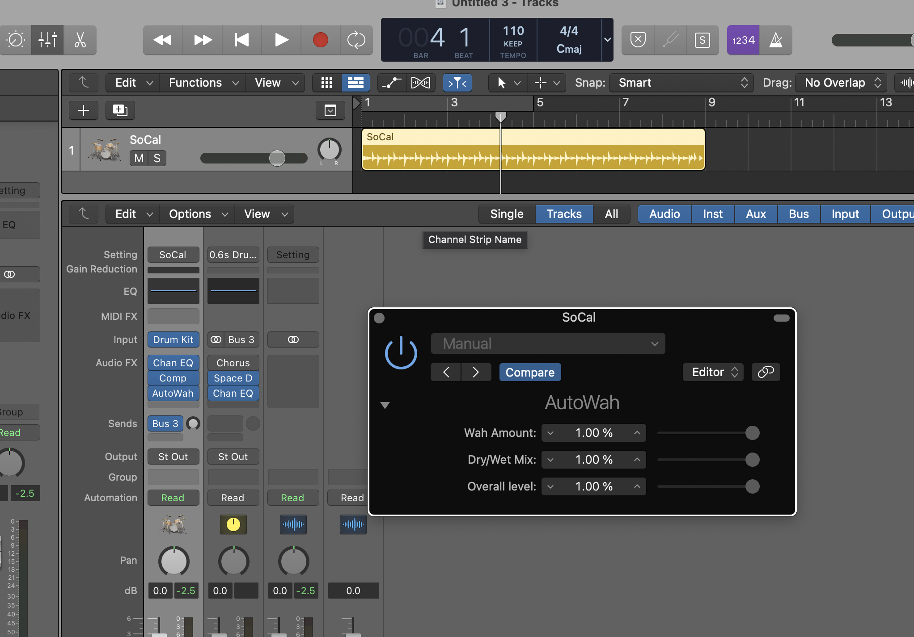

# AUv3HelloWorld
 
A work-in-progress example of how to create an AUv3 with [AudioKit](https://github.com/AudioKit)

# Notes: 
- This example takes many shortcuts and is not meant to be used in production. It's more of a tool to help others learn.
- This Audio Unit Effect needs to be loaded onto a MIDI track at the moment for it to work.
- The component description of the Audio Unit needs to match that of the AudioKit Audio AudioUnit it wraps.
- Currently researching on ways to customize the component description and add more effects

